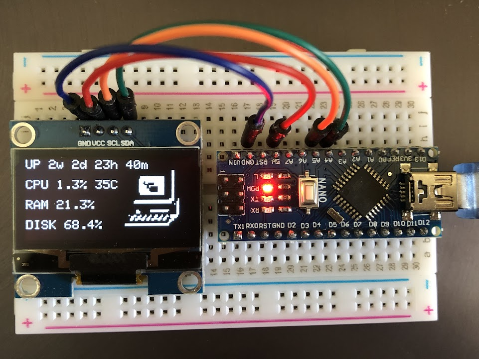

# Arduino Linux Monitor with 128x64 OLED Display

## Description
A light weight and energy efficient way to monitor the status of linux computers in real-time. Perfect for headless home servers. It is able to display server uptime, CPU usage, core temperature, RAM usage, and storage availability.

## Example

## Hardware Components
- Any type of Arduino Board. I am using Arduino Nano for to its compactness.
- 0.96 inch I2C OLED display (either SSD1306 or SSH110X works)
- Breadboard
- Jumper wires
- Computer running any Linux distro

## Executing the Program
1. Create USB rules to enable linux permissions. Create a file `/etc/udev/rules.d/50-myusb.rules` and add a line: `KERNEL=="ttyUSB[0-9]*",MODE="0666"`. This allows the computer to communicate with the arduino. 
2. Upload the arduino code to your Arduino using the Arduino IDE. You must install drivers for your OLED display. 
3. Install the necessary python packages on the host computer: `psutil`, `pyserial`, `pyudev`.
4. `chmod +x system.py` to set it as executable files. 
5. Run script `./system.py` on the host computer, the Arduino should update the computer stats every 10 seconds.

## Setup Automatic USB detectection
This allows the arduino to work everytime it is plugged in without manually running a script.
1. run `usb-devices` command on the linux computer while the Arduino is plugged in. Find the 4 lettered Vendor value for your Arduino.
2. Edit the `usb.py` file with your arduino vendor id.
3. `nohup ./usb.py &` to run the script in the background. This script will run `system.py` whenever your arduino is plugged into the computer.
